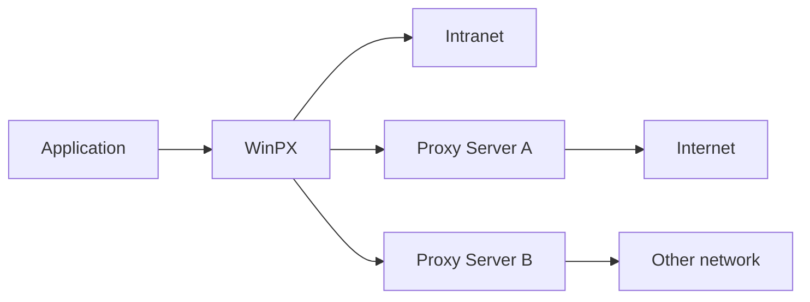

# WinPX Proxy Server for Windows

**WinPX** is a forwarding HTTP proxy server for Windows.

It is designed to help legacy applications connect to enterprise proxy servers.

By running locally on your PC, **WinPX** abstracts away complex proxy requirements like PAC files and Kerberos/NTLM authentication,
presenting a simple HTTP proxy interface to your applications.

## Features

- High-performance implementation in C++ with a low memory footprint.
- Automatic setup via Windows system proxy configuration.
- Supports **Proxy Auto-Configuration (PAC)** and **Web Proxy Auto-Discovery (WPAD)** protocols.
- Supports enterprise authentication methods such as **Negotiate (SPNEGO)** via **NTLM** or **Kerberos**.
- Supports local authentication for added security in a shared **Remote Desktop Services (RDS)** environment.
- Supports **Windows Group Policy** for enterprise deployment.

## Background

In a corporate network environment, companies often employ proxy servers to control access to the Internet,
filter and cache web content, and provide anonymity and security.

Instead of allowing direct access to the Internet, applications are required to connect to the enterprise proxy server first,
and the enterprise proxy server will then forward the requests to the Internet.

Many applications fail to work correctly in such environments.
There are multiple things that can go wrong:

- Applications are not aware of the proxy because they do not read the Windows proxy configuration.
- Applications do not support proxy settings such as **Proxy Auto-Configuration (PAC)** or **Web Proxy Auto-Discovery (WPAD)**.
- Applications do not support proxy authentication methods such as **Negotiate** via **NTLM** or **Kerberos**.

**WinPX** is designed to solve these problems by acting as an intermediate proxy server running locally on your PC.
**WinPX** automatically configures itself based on the Windows proxy configuration of your PC
and handles the authentication when connecting to the enterprise proxy server.

Instead of pointing your applications directly to the enterprise proxy server,
you configure your applications to use the **WinPX** proxy server.
**WinPX** will then forward the application requests to the appropriate proxy gateways.

For instance, a typical network setup may look like this:



## Installing WinPX

**WinPX** requires **Windows 10** or later, and is distributed as a **standalone executable** that requires no installation.

To download the latest version of **WinPX**, please visit the [WinPX GitHub Releases page](https://github.com/mariusgreuel/winpx/releases).

Two variants are available:

- `winpx.exe`: the **Windows GUI version**, which is recommended for most users.
- `winpxc.exe`: the **command-line version**, which is intended for servers and can be run as a Windows service.

To run **WinPX**, simply double-click the executable file.

## Using WinPX with Windows Subsystem for Linux (WSL)

If you use WSL (WSL2), you can configure the WSL environment to use the **WinPX** proxy server as well.

Starting with **Windows 11 22H2**, WSL networking has been significantly improved.
Besides **NAT** (the default networking mode), WSL now supports the networking modes **Mirrored** and **VirtioProxy**.
These two modes allow WSL to access the Windows host network directly, so you can reach the Windows localhost address `127.0.0.1` from within WSL.
In **NAT** mode, `127.0.0.1` refers to the Linux distribution itself, so the steps below do not apply.

To use WinPX with WSL, follow these steps:

- Ensure that you have an up-to-date version of WSL installed by running the command `wsl.exe --update` in an elevated Windows Command Prompt.
- Open the **WSL Settings** dialog from the Windows Start menu and set the networking mode to **Mirrored**.

You can now set up a Linux distribution in WSL and access the **WinPX** proxy server URL from within Linux.

To verify that the **WinPX** proxy server is reachable from within WSL, run the command `curl --head http://127.0.0.1:3128` from a Linux shell.

To configure the WSL environment to use the **WinPX** proxy server, you should set the `http_proxy` and `https_proxy` environment variables
by adding the following lines to your shell configuration file (e.g. `.bashrc`):

```bash
export http_proxy=http://127.0.0.1:3128
export https_proxy=$http_proxy
```

## Using WinPX with Remote Desktop Services (RDS)

If you use **WinPX** in a shared Remote Desktop Services (RDS) environment, you should be aware of the security implications.

When you log on to a Windows RDS session, you share a Windows Server instance with other users.
Since those users are on the same machine, they can reach all localhost addresses, including the **WinPX** proxy server running in your session.
In other words, other users could hijack your **WinPX** proxy server and access the Internet using your credentials without your knowledge.

To prevent this, enable **local authentication** in **WinPX**. This feature requires clients to authenticate against your local **WinPX** proxy server using a secret.
For instance, instead of using the proxy URL `http://127.0.0.1:3128`, you are required to use a URL like `http://svQxYCPdRS8hSfSH@127.0.0.1:3128`.
The secret `svQxYCPdRS8hSfSH` is randomly generated and available only to your user account.
Without this secret, your **WinPX** proxy server will reject any requests with the error `407 Proxy Authentication Required`.

## Running WinPX as a Windows Service

You can run **WinPX** as a Windows service, which allows it to start automatically when the system starts, without requiring a user to log in.

To install **WinPX** as a Windows service, you can run the WinPX command-line version `winpxc.exe` and use the `--install-service` argument.

```bat
winpxc.exe --install-service --run
```

When the service is installed, you can view and modify it from the **Windows Services** management console.

For instance, you probably want to change the user account that the service runs under,
so that it can access the user's Windows proxy configuration and perform the upstream proxy authentication.

If the account running the service does not have the correct Windows proxy settings, configure **WinPX** explicitly using the appropriate command-line options.
For instance, if your company uses a Proxy Auto-Configuration (PAC) file and you want to use a specific one, you can run the following command:

```bat
winpxc.exe --install-service --pac-url=http://proxy.contoso.com/contoso.pac
```

## References

- [Windows Subsystem for Linux Documentation]
- [Accessing network applications with WSL]

[Windows Subsystem for Linux Documentation]: https://learn.microsoft.com/en-us/windows/wsl
[Accessing network applications with WSL]: https://learn.microsoft.com/en-us/windows/wsl/networking

## License

**WinPX** is Copyright © 2021 Marius Greuel. All rights reserved.

**WinPX** is licensed under the [GNU General Public License version 3 (GPLv3)](LICENSE).
